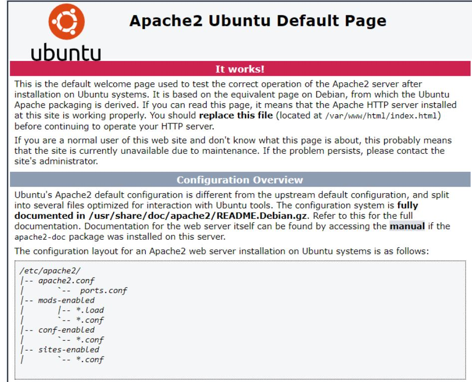

### DEPLOY A PORTFOLIO WEBSITE TO AWS
#### USING EC2 
- I downloaded a free html & css website template and modified it through vscode.
- Set up an ec2 instance.
- Push the code to github and then clone it toyour ec2
- By using 
```
git clone https://github.com/chidinmaa/iPortfolio.git

```
### INSTALL APACHE USING UBUNTU
- Used APACHE as my webserver
```
sudo apt update
sudo apt install apache2
```
-To verify that apache2 is running as a Service in our OS, use following command.
```
sudo apt enable apache2
sudo apt start apache2
sudo systemctl status apache2
 ```
 - Enable port 80 Before we can receive any traffic by our Web Server, we need to open TCP port 80 which is the default port that web browsers use to access web pages on the Internet.
 
 ### CREATE A VIRTUAL HOST FOR YOUR WEBSITE USING APACHE
 ```
 sudo mkdir /var/www/portfolio
 sudo cp -a iPortfolio/. /var/www/portfolio/
 ls
 ```
 - This is to copy all your files from your git content to your new folder.
 ```
  sudo chown -R $USER:$USER /var/www/portfolio
  sudo vi /etc/apache2/sites-available/portfolio.conf
  ```
  ```
  <VirtualHost *:80>
    ServerName portfolio
    ServerAlias www.paschaline.com 
    ServerAdmin webmaster@localhost
    DocumentRoot /var/www/portfolio
    ErrorLog ${APACHE_LOG_DIR}/error.log
    CustomLog ${APACHE_LOG_DIR}/access.log combined
</VirtualHost>
```
```
sudo ls /etc/apache2/sites-available

 sudo a2ensite portfolio
 sudo a2dissite 000-default
sudo apache2ctl configtest
sudo systemctl reload apache2
```
Now go to your browser and try to open your website URL using IP address:
```
http://<Public-IP-Address>:80
```

### REGISTER A NEW DOMAIN NAME
- I registered a new domain name with paschaline.com
- create a new record in route 53 with your domain name and ec2 ip address.
Install  certbot  and request for an SSL/TLS certificate
Make sure  snapd  service is active and running
```
sudo systemctl status snapd
```
Install certbot
```
sudo snap install --classic certbot
sudo certbot --apache
```
-Test secured access to your Web Solution by trying to reach www.paschaline.com


