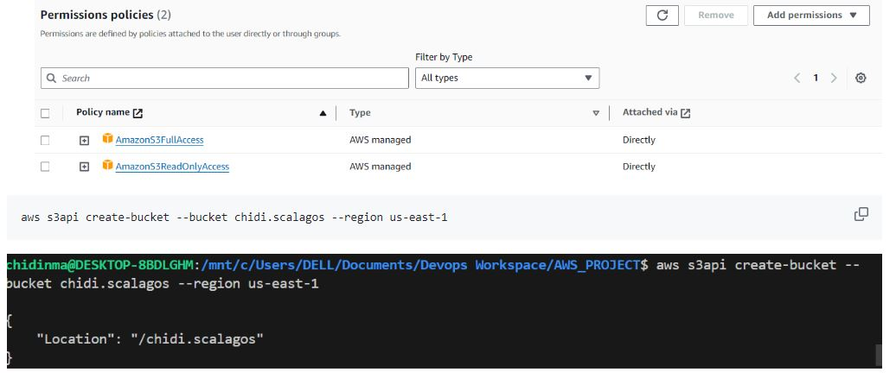

### CREATE AN S3 BUCKET FROM THE CLI
- I used my vscode to create and push my codes
```
curl "https://s3.amazonaws.com/aws-cli/awscli-bundle.zip" -o "awscli-bundle.zip"

unzip awscli-bundle.zip

sudo apt install awscli

aws --version
```
- Answer Y to continue to download
```
aws configure
```


- It will request for your access and secret key from your user in IAM.
- Before you create your bucket allow s3 fullaccess permissions.



```
aws s3api create-bucket --bucket chidi.scalagos --region us-east-1
```


- Create Access Keys for the User.
- compile your work in a bash script.


```

###############################################################################
# function iecho
#
# This function enables the script to display the specified text only if
# the global variable $VERBOSE is set to true.
###############################################################################
function iecho() {
  if [[ $VERBOSE == true ]]; then
    echo "$@"
  fi
}

###############################################################################
# function errecho
#
# This function outputs everything sent to it to STDERR (standard error output).
###############################################################################
function errecho() {
  printf "%s\n" "$*" 1>&2
}

###############################################################################
# function create-bucket
#
# This function creates the specified bucket in the specified AWS Region, unless
# it already exists.
#
# Parameters:
#       -b bucket_name  -- The name of the bucket to create.
#       -r region_code  -- The code for an AWS Region in which to
#                          create the bucket.
#
# Returns:
#       The URL of the bucket that was created.
#     And:
#       0 - If successful.
#       1 - If it fails.
###############################################################################
function create_bucket() {
  local bucket_name region_code response
  local option OPTARG # Required to use getopts command in a function.

  # bashsupport disable=BP5008
  function usage() {
    echo "function create_bucket"
    echo "Creates an Amazon S3 bucket. You must supply a bucket name:"
    echo "  -b bucket_name    The name of the bucket. It must be globally unique."
    echo "  [-r region_code]    The code for an AWS Region in which the bucket is created."
    echo ""
  }

  # Retrieve the calling parameters.
  while getopts "b:r:h" option; do
    case "${option}" in
      b) bucket_name="${OPTARG}" ;;
      r) region_code="${OPTARG}" ;;
      h)
        usage
        return 0
        ;;
      \?)
        echo "Invalid parameter"
        usage
        return 1
        ;;
    esac
  done

  if [[ -z "$chidi.scalagos" ]]; then
    errecho "ERROR: You must provide a bucket name with the -b parameter."
    usage
    return 1
  fi

  local bucket_config_arg
  # A location constraint for "us-east-1" returns an error.
  if [[ -n "$region_code" ]] && [[ "$region_code" != "us-east-1" ]]; then
    bucket_config_arg="--create-bucket-configuration LocationConstraint=$region_code"
  fi

  iecho "Parameters:\n"
  iecho "    Bucket name:   $chidi.scalagos"
  iecho "    Region code:   $us-east-1"
  iecho ""

  # If the bucket already exists, we don't want to try to create it.
  if (bucket_exists "$chidi.scalagos"); then
    errecho "ERROR: A bucket with that name already exists. Try again."
    return 1
  fi

  # shellcheck disable=SC2086
  response=$(aws s3api create-bucket \
    --bucket "$chidi.bucket" \
    $bucket_config_arg)

  # shellcheck disable=SC2181
  if [[ ${?} -ne 0 ]]; then
    errecho "ERROR: AWS reports create-bucket operation failed.\n$response"
    return 1
  fi
}

```